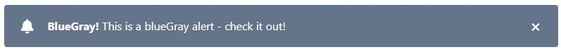

# Alert widget

[The alert component](https://www.creative-tim.com/learning-lab/tailwind-starter-kit/documentation/javascript/alerts) elements that provide contextual feedback messages for user actions. The notification is a simple colored block meant to draw the attention to the user about something.

<p align="center">
    
</p>

HTML generated consists of:

- `div` - main container.
- `span` - icon-container.
- `i` - icon.
- `span` - message.
- `button` - close button.

## Usage

```php
<?php

declare(strict_types=1);

use Yii\Extension\Tailwind\Asset\TailwindStarterKitAsset;
use Yiisoft\Assets\AssetManager;
use Yiisoft\View\WebView

/**
 * @var AssetManager $assetManager
 * @var WebView $this
 */

/* Register assets in view */
$assetManager->register([TailwindStarterKitAsset::class]);

$this->addCssFiles($assetManager->getCssFiles());
$this->addJsFiles($assetManager->getJsFiles());
?>

<?= 
    Alert::widget()
        ->icon('fas fa-bell')
        ->message('<b>BlueGray!</b> This is a pink alert - check it out!');
?>
```

HTML produced is like the following:

```html
<div id="w0-alert" class="bg-blueGray-500 border-0 mb-4 px-6 py-4 relative rounded text-white">
    <span class="align-middle inline-block mr-5 text-xl"><i class="fas fa-bell"></i></span>
    <span class="align-middle inline-block mr-8 text-white"><b>BlueGray!</b> This is a pink alert - check it out!</span>
    <button type="button" class="absolute bg-transparent focus:outline-none font-semibold leading-none mr-6 mt-4 outline-none right-0 text-2xl top-0" onclick="closeAlert(event)">x</button>
</div>
```

Method | Description | Default
-------|-------------|---------
`backgroundColorTheme(string $value)` | Button background color | `'bg-blueGray-500'`
`buttonAttributes(array $value)` | HTML attributes for the button. | `[]`
`icon(string $value)` | The icon message. | `''`
`message(string $value)` | The message content. | `''`
`textColorTheme(string $value)` | Button text color label | `'text-white'`
`withoutButton()` | Disable close button. | `false`
`withoutLoadDefaultTheme()` | Disable all default classes in the widget. | `false`

```php
$items = [
    [
        'label' => string, // text label
        'labelAttributes' => array, // attributes for label container tag
        'url' => string, // url
        'urlAttributes' => array, // attributes for a tag
        'icon' => string // icon class
        'iconAttributes' => array, // attributes for icon container tag
        'active' => bool, // If the option is active
        'encode' => bool, // If the label is encode,
        'items' => array, // array, optional, the sub-dropdown items. The structure is the same.
    ]
];
```
