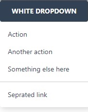

# Dropdown widget

[The dropdown component](https://www.creative-tim.com/learning-lab/tailwind-starter-kit/documentation/javascript/dropdown) is a container for a dropdown button and
a dropdown menu.

<p align="center">
    
</p>

HTML generated consists of:

- `div` - main container.
- `div` - sub-container.
- `div` - container for trigger and items.
- `button` - button.
- `a` - item.

## Usage

```php
<?php

declare(strict_types=1);

use Yii\Extension\Tailwind\Asset\TailwindStarterKitAsset;
use Yiisoft\Assets\AssetManager;
use Yiisoft\View\WebView

/**
 * @var AssetManager $assetManager
 * @var WebView $this
 */

/* Register assets in view */
$assetManager->register([TailwindStarterKitAsset::class]);

$this->addCssFiles($assetManager->getCssFiles());
$this->addJsFiles($assetManager->getJsFiles());
?>

<?= Dropdown::widget()
    ->items([
        ['label' => 'Action'],
        ['label' => 'Another action'],
        ['label' => 'Something else here'],
        '-',
        ['label' => 'Separated link'],
    ])
    ->render();
?>
```

HTML produced is like the following:

```html
<div class="flex flex-wrap">
    <div class="md:w-4/12 px-4 sm:w-6/12 w-full">
        <div class="align-middle inline-flex relative w-full">
            <button class="bg-blueGray-500 text-white duration-150 ease-linear focus:outline-none font-bold hover:shadow-lg mb-1 mr-1 outline-none px-6 py-3 rounded shadow text-sm transition-all uppercase" onclick="openDropdown(event, &apos;w1-dropdown&apos;)"><span>Dropdown</span><i class="pl-2">&#8595;</i></button>
            <div id="w1-dropdown" class="float-left hidden bg-white list-none mt-1 py-2 rounded shadow-lg text-base text-left z-50" style="min-width:12rem">
                <a class="block font-normal px-4 py-2 text-sm w-full whitespace-nowrap text-blueGray-700 bg-transparent"><span>Action</span></a>
                <a class="block font-normal px-4 py-2 text-sm w-full whitespace-nowrap text-blueGray-700 bg-transparent"><span>Another action</span></a>
                <a class="block font-normal px-4 py-2 text-sm w-full whitespace-nowrap text-blueGray-700 bg-transparent"><span>Something else here</span></a>
                <div class="border-blueGray-800 border-solid border-t-0 border h-0 my-2 opacity-25"></div>
                <a class="block font-normal px-4 py-2 text-sm w-full whitespace-nowrap text-blueGray-700 bg-transparent"><span>Separated link</span></a>
            </div>
        </div>
    </div>
</div>
```

Method | Description | Default
-------|-------------|---------
`buttonAttributes(array $value)` | HTML attributes for the button. | `[]`
`buttonLabel(string $value)` | Set label button. | `'Dropdown'`
`buttonLabelAttributes(array $value)`| HTML attributes for the button label. | `[]`
`buttonBackgroundColor(string $value)` | Button background color | `'bg-blueGray-500'`
`buttonTextColor(string $value)` | Button text color label | `'text-white'`
`buttonSubDropdownAttributes(array $value)` | HTML button sub-dropdown attributes. | `[]`
`buttonSubDropdownBackgroundColor(string $value)` | Button sub-dropdown background color | `'bg-transparent'`
`buttonSubDropdownTextColor(string $value)` | Button sub-dropdown text color | `'text-black'`
`buttonIcon(string $value)` | Icon button | `'&#8595;'`
`containerAttributes(array $value)` | HTML attributes for the main container | `[]`
`containerTriggerAttributes(array $value)` | HTML attributes for the trigger button | `[]`
`currentPath(string $value)` | Allows you to assign the current path of the URL from request controller. | `''`
`dividerAttributes(string $value)` | HTML attributes for divider. | `[]` 
`items(array $value)` | List of menu items. | `[]`
`itemsContainerAttributes(array $value)` | HTML attributes for the items container attributes. | `[]`
`urlAttributes(array $value)` | HTML attributes for the url attributes. | `[]`
`withoutActivateItems()`  | Disable activate items according to whether their `currentPath`. | `false`
`withoutLoadDefaultTheme()` | Disable all default classes in the widget. | `false`

```php
$items = [
    [
        'label' => string, // text label
        'labelAttributes' => array, // attributes for label container tag
        'url' => string, // url
        'urlAttributes' => array, // attributes for a tag
        'icon' => string // icon class
        'iconAttributes' => array, // attributes for icon container tag
        'active' => bool, // If the option is active
        'encode' => bool, // If the label is encode,
        'items' => array, // array, optional, the sub-dropdown items. The structure is the same.
    ]
];
```

**List background color**

```HTML
Dropdown::BG_AMBER, Dropdown::BG_BLACK, Dropdown::BG_BLUGRAY, Dropdown::BG_EMERALD
Dropdown::BG_INDIGO, Dropdown::BG_LIGHTBLUE, Dropdown::BG_ORANGE, Dropdown::BG_PINK
Dropdown::BG_PURPLE, Dropdown::BG_RED, Dropdown::BG_TEAL, Dropdown::BG_WHITE
```

**List text color**

```html
text-black, text-white, text-pink-500, text-purple-500, text-indigo-500
text-blue-500, ext-lightBlue-500`, text-teal-400, text-emerald-500
text-
