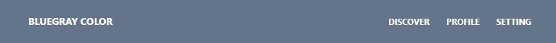
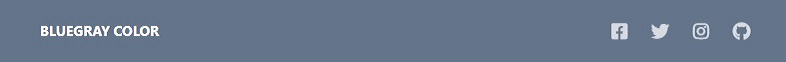
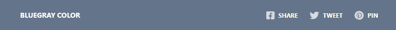
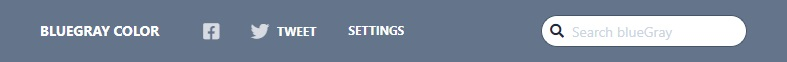

# Navbar

[The navbar component](https://www.creative-tim.com/learning-lab/tailwind-starter-kit/documentation/css/navbars) is a responsive and versatile horizontal navigation bar.

HTML generated consists of:

- `nav` - main container.
- `div` - container for brand.
- `span` - brand.
- `div` - container toggle button.
- `button` - toggle button.
- `div` - container items.
- `ul` - container list items.
- `li` - list item.
- `a` - item.

## Text
The following example features a brand on the left and some text links on the right.

<p align="center">
    
</p>

</br>

Example:
```php
<?php

declare(strict_types=1);

use Yii\Extension\Tailwind\Asset\TailwindStarterKitAsset;
use Yiisoft\Assets\AssetManager;
use Yiisoft\Router\UrlGeneratorInterface;
use Yiisoft\Router\UrlMatcherInterface;
use Yiisoft\View\WebView

/**
 * @var AssetManager $assetManager
 * @var UrlGeneratorInterface $urlGenerator
 * @var UrlMatcherInterface $urlMatcher
 * @var WebView $this
 */

/* Register assets in view */
$assetManager->register([TailwindStarterKitAsset::class]);

$this->setCssFiles($assetManager->getCssFiles());
$this->setJsFiles($assetManager->getJsFiles());

if ($urlMatcher->getCurrentRoute() !== null) {
    $currentPath = $urlMatcher->getCurrentUri()->getPath();
}

NavBar::widget()
    ->backGroundColorTheme(Navbar::BG_BLUGRAY)
    ->brandLink('/')
    ->brandText('BLUEGRAY COLOR')
    ->currentPath($currentPath)
    ->items([
        ['label' => 'discover', 'url' => '#'],
        ['label' => 'profile', 'url' => '#'],
        ['label' => 'setting', 'url' => '#'],
    ])
    ->begin();

NavBar::end();
```

HTML produced is like the following:

```html
<nav id="w0-navbar" class="bg-blueGray-500 flex-wrap flex items-center mb-3 px-2 py-3 relative">
    <div class="container flex-wrap flex items-center justify-between mx-auto px-4">
        <div class="flex justify-between lg:justify-start lg:static lg:w-auto px-4 relative">
            <a class="font-bold inline-block leading-relaxed px-4 text-sm uppercase whitespace-nowrap text-white" href="/">BLUEGRAY COLOR</a>
        </div>
        <div>
            <button type="button" class="block border-solid border-transparent border cursor-pointer focus:outline-none leading-none lg:hidden outline-none px-3 py-1 rounded bg-transparent text-xl text-white" onclick="toggleNavbar(&apos;w0-items-navbar&apos;)">☰</button>
        </div>
        <div id="w0-items-navbar" class="flex-grow hidden items-center lg:flex">
            <ul class="flex-col flex lg:flex-row lg:ml-auto list-none">
                <li class="nav-item">
                    <a class="flex font-bold hover:opacity-75 items-center leading-snug px-3 py-2 text-xs uppercase text-white" href="#">discover</a>
                </li>
                <li class="nav-item">
                    <a class="flex font-bold hover:opacity-75 items-center leading-snug px-3 py-2 text-xs uppercase text-white" href="#">profile</a>
                </li>
                <li class="nav-item">
                    <a class="flex font-bold hover:opacity-75 items-center leading-snug px-3 py-2 text-xs uppercase text-white" href="#">setting</a>
                </li>
            </ul>
        </div>
    </div>
</nav>
```

## Icons

You can leave the text, and only give your users some intuitive icon links.

<p align="center">
    
</p>

</br>

Example:
```php
<?php

declare(strict_types=1);

use Yii\Extension\Tailwind\Asset\TailwindStarterKitAsset;
use Yiisoft\Assets\AssetManager;
use Yiisoft\Router\UrlGeneratorInterface;
use Yiisoft\Router\UrlMatcherInterface;
use Yiisoft\View\WebView

/**
 * @var AssetManager $assetManager
 * @var UrlGeneratorInterface $urlGenerator
 * @var UrlMatcherInterface $urlMatcher
 * @var WebView $this
 */

/* Register assets in view */
$assetManager->register([TailwindStarterKitAsset::class]);

$this->setCssFiles($assetManager->getCssFiles());
$this->setJsFiles($assetManager->getJsFiles());

if ($urlMatcher->getCurrentRoute() !== null) {
    $currentPath = $urlMatcher->getCurrentUri()->getPath();
}
?> 

<?= NavBar::widget()
    ->backGroundColorTheme(Navbar::BG_BLUGRAY)
    ->brandLink('/')
    ->brandText('BLUEGRAY COLOR')
    ->currentPath('/')
    ->items([
        ['icon' => 'fab fa-facebook-square text-lg leading-lg text-white opacity-75', 'url' => '#'],
        ['icon' => 'fab fa-twitter text-lg leading-lg text-white opacity-75', 'url' => '#'],
        ['icon' => 'fab fa-instagram text-lg leading-lg text-white opacity-75', 'url' => '#'],
        ['icon' => 'fab fa-github text-lg leading-lg text-white opacity-75', 'url' => '#'],
    ])
    ->begin() ?>

<?= NavBar::end() ?>
```

HTML produced is like the following:

```html
<nav id="w1-navbar" class="bg-blueGray-500 flex-wrap flex items-center mb-3 px-2 py-3 relative">
    <div class="container flex-wrap flex items-center justify-between mx-auto px-4">
        <div class="flex justify-between lg:justify-start lg:static lg:w-auto px-4 relative">
            <a class="font-bold inline-block leading-relaxed px-4 text-sm uppercase whitespace-nowrap text-white" href="/">BLUEGRAY COLOR</a>
        </div>
        <div>
            <button type="button" class="block border-solid border-transparent border cursor-pointer focus:outline-none leading-none lg:hidden outline-none px-3 py-1 rounded bg-transparent text-xl text-white" onclick="toggleNavbar(&apos;w1-items-navbar&apos;)">☰</button>
        </div>
        <div id="w1-items-navbar" class="flex-grow hidden items-center lg:flex">
            <ul class="flex-col flex lg:flex-row lg:ml-auto list-none">
                <li class="nav-item">
                    <a class="flex font-bold hover:opacity-75 items-center leading-snug px-3 py-2 text-xs uppercase text-white" href="#">
                        <span><i class="fab fa-facebook-square text-lg leading-lg text-white opacity-75"></i></span>
                    </a>
                </li>
                <li class="nav-item">
                    <a class="flex font-bold hover:opacity-75 items-center leading-snug px-3 py-2 text-xs uppercase text-white" href="#">
                        <span><i class="fab fa-twitter text-lg leading-lg text-white opacity-75"></i></span>
                    </a>
                </li>
                <li class="nav-item">
                    <a class="flex font-bold hover:opacity-75 items-center leading-snug px-3 py-2 text-xs uppercase text-white" href="#">
                        <span><i class="fab fa-instagram text-lg leading-lg text-white opacity-75"></i></span>
                    </a>
                </li>
                <li class="nav-item">
                    <a class="flex font-bold hover:opacity-75 items-center leading-snug px-3 py-2 text-xs uppercase text-white" href="#">
                        <span><i class="fab fa-github text-lg leading-lg text-white opacity-75"></i></span>
                    </a>
                </li>
            </ul>
        </div>
    </div>
</nav>
```

## Icons and Text
The following example features a brand on the left and some text and icon links on the right.

<p align="center">
    
</p>

</br>

Example:
```php
<?php

declare(strict_types=1);

use Yii\Extension\Tailwind\Asset\TailwindStarterKitAsset;
use Yiisoft\Assets\AssetManager;
use Yiisoft\Router\UrlGeneratorInterface;
use Yiisoft\Router\UrlMatcherInterface;
use Yiisoft\View\WebView

/**
 * @var AssetManager $assetManager
 * @var UrlGeneratorInterface $urlGenerator
 * @var UrlMatcherInterface $urlMatcher
 * @var WebView $this
 */

/* Register assets in view */
$assetManager->register([TailwindStarterKitAsset::class]);

$this->setCssFiles($assetManager->getCssFiles());
$this->setJsFiles($assetManager->getJsFiles());

if ($urlMatcher->getCurrentRoute() !== null) {
    $currentPath = $urlMatcher->getCurrentUri()->getPath();
}
?>

<?= NavBar::widget()
    ->backGroundColorTheme(Navbar::BG_BLUGRAY)
    ->brandLink('/')
    ->brandText('BLUEGRAY COLOR')
    ->currentPath('/')
    ->items([
        ['label' => 'share', 'icon' => 'fab fa-facebook-square text-lg leading-lg px-2 text-white opacity-75', 'url' => '#'],
        ['label' => 'tweet', 'icon' => 'fab fa-twitter text-lg leading-lg px-2 text-white opacity-75', 'url' => '#'],
        ['label' => 'pin', 'icon' => 'fab fa-pinterest text-lg leading-lg px-2 text-white opacity-75', 'url' => '#'],
    ])
    ->begin() ?>

<?= NavBar::end() ?>
```

HTML produced is like the following:

```html
<nav id="w1-navbar" class="bg-blueGray-500 flex-wrap flex items-center mb-3 px-2 py-3 relative">
    <div class="container flex-wrap flex items-center justify-between mx-auto px-4">
        <div class="flex justify-between lg:justify-start lg:static lg:w-auto px-4 relative">
            <a class="font-bold inline-block leading-relaxed px-4 text-sm uppercase whitespace-nowrap text-white" href="/">BLUEGRAY COLOR</a>
        </div>
        <div>
            <button type="button" class="block border-solid border-transparent border cursor-pointer focus:outline-none leading-none lg:hidden outline-none px-3 py-1 rounded bg-transparent text-xl text-white" onclick="toggleNavbar(&apos;w1-items-navbar&apos;)">☰</button>
        </div>
        <div id="w1-items-navbar" class="flex-grow hidden items-center lg:flex">
            <ul class="flex-col flex lg:flex-row lg:ml-auto list-none">
                <li class="nav-item">
                    <a class="flex font-bold hover:opacity-75 items-center leading-snug px-3 py-2 text-xs uppercase text-white" href="#">
                        <span><i class="fab fa-facebook-square text-lg leading-lg px-2 text-white opacity-75"></i>share</span>
                    </a>
                </li>
                <li class="nav-item">
                    <a class="flex font-bold hover:opacity-75 items-center leading-snug px-3 py-2 text-xs uppercase text-white" href="#">
                        <span><i class="fab fa-twitter text-lg leading-lg px-2 text-white opacity-75"></i>tweet</span>
                    </a>
                </li>
                <li class="nav-item">
                    <a class="flex font-bold hover:opacity-75 items-center leading-snug px-3 py-2 text-xs uppercase text-white" href="#">
                        <span><i class="fab fa-pinterest text-lg leading-lg px-2 text-white opacity-75"></i>pin</span>
                    </a>
                </li>
            </ul>
        </div>
    </div>
</nav>
```

## Search bar
You can also have a search bar inside your navigation menu. On the left you can keep your brand text with some links, and on the right you can have a search for your website.


<p align="center">
    
</p>

</br>

Example:
```php
<?php

declare(strict_types=1);

use Yii\Extension\Tailwind\Asset\TailwindStarterKitAsset;
use Yiisoft\Assets\AssetManager;
use Yiisoft\Router\UrlGeneratorInterface;
use Yiisoft\Router\UrlMatcherInterface;
use Yiisoft\View\WebView

/**
 * @var AssetManager $assetManager
 * @var UrlGeneratorInterface $urlGenerator
 * @var UrlMatcherInterface $urlMatcher
 * @var WebView $this
 */

/* Register assets in view */
$assetManager->register([TailwindStarterKitAsset::class]);

$this->setCssFiles($assetManager->getCssFiles());
$this->setJsFiles($assetManager->getJsFiles());

if ($urlMatcher->getCurrentRoute() !== null) {
    $currentPath = $urlMatcher->getCurrentUri()->getPath();
}
?>

<?= NavBar::widget()
    ->backGroundColorTheme(Navbar::BG_BLUGRAY)
    ->brandLink('/')
    ->brandText('BLUEGRAY COLOR')
    ->containerItemsAttributes(['class' => 'lg:flex flex-grow items-center'])
    ->currentPath('/')
    ->items([
        ['icon' => 'fab fa-facebook-square text-lg leading-lg px-2 text-white opacity-75', 'url' => '#'],
        ['label' => 'tweet', 'icon' => 'fab fa-twitter text-lg leading-lg px-2 text-white opacity-75', 'url' => '#'],
        ['label' => 'settings', 'url' => '#', 'labelOptions' => ['class' => 'text-lg']],
    ])
    ->ulAttributes(['class' => 'flex flex-col lg:flex-row list-none'])
    ->begin() ?>

    <?=
    Html::openTag('div', ['class' => 'relative flex w-full sm:w-7/12 md:w-5/12 px-4 flex-wrap items-stretch lg:ml-auto']) . "\n" .
        Html::openTag('div', ['class' => 'flex']) . "\n" .
            Html::openTag('span', ['class' => 'font-normal leading-snug flex text-center white-space-no-wrap border border-solid border-blueGray-600 rounded-full text-sm bg-white items-center rounded-r-none pl-2 py-1 text-blueGray-800 border-r-0 placeholder-blueGray-300']) . "\n" .
                Html::tag('i', '', ['class' => 'fas fa-search']) .
            Html::closeTag('span') . "\n" .
        Html::closeTag('div') . "\n" .
        Html::input('text', 'search')
            ->attributes(
                [
                    'class' => 'px-2 py-1 h-8 border border-solid  border-blueGray-600 rounded-full text-sm leading-snug text-blueGray-700 bg-white shadow-none outline-none focus:outline-none w-full font-normal rounded-l-none flex-1 border-l-0 placeholder-blueGray-300',
                    'placeholder' => 'Search blueGray'
                ]
            ) . "\n" .
    Html::closeTag('div') . "\n" ?>

<?= NavBar::end() ?>
```

```html
<nav id="w0-navbar" class="bg-blueGray-500 flex-wrap flex items-center mb-3 px-2 py-3 relative">
    <div class="container flex-wrap flex items-center justify-between mx-auto px-4">
        <div class="flex justify-between lg:justify-start lg:static lg:w-auto px-4 relative">
            <a class="font-bold inline-block leading-relaxed px-4 text-sm uppercase whitespace-nowrap text-white" href="/">BLUEGRAY COLOR</a>
        </div>
        <div>
            <button type="button" class="block border-solid border-transparent border cursor-pointer focus:outline-none leading-none lg:hidden outline-none px-3 py-1 rounded bg-transparent text-xl text-white" onclick="toggleNavbar(&apos;w0-items-navbar&apos;)">☰</button>
        </div>
        <div id="w0-items-navbar" class="lg:flex flex-grow items-center hidden">
            <ul class="flex flex-col lg:flex-row list-none mr-auto lg:ml-auto">
                <li class="nav-item">
                    <a class="flex font-bold hover:opacity-75 items-center leading-snug px-3 py-2 text-xs uppercase text-white" href="#">
                        <span><i class="fab fa-facebook-square text-lg leading-lg px-2 text-white opacity-75"></i></span>
                    </a>
                </li>
                <li class="nav-item">
                    <a class="flex font-bold hover:opacity-75 items-center leading-snug px-3 py-2 text-xs uppercase text-white" href="#">
                        <span><i class="fab fa-twitter text-lg leading-lg px-2 text-white opacity-75"></i></span>
                        <span>tweet</span>
                    </a>
                </li>
                <li class="nav-item">
                    <a class="flex font-bold hover:opacity-75 items-center leading-snug px-3 py-2 text-xs uppercase text-white" href="#"><span>settings</span>
                    </a>
                </li>
            </ul>
            <div class="relative flex w-full sm:w-7/12 md:w-5/12 px-4 flex-wrap items-stretch lg:ml-auto">
                <div class="flex">
                    <span class="font-normal leading-snug flex text-center white-space-no-wrap border border-solid border-blueGray-600 rounded-full text-sm bg-white items-center rounded-r-none pl-2 py-1 text-blueGray-800 border-r-0 placeholder-blueGray-300">
                        <i class="fas fa-search">
                        </i>
                    </span>
                </div>
                <input type="text" class="px-2 py-1 h-8 border border-solid  border-blueGray-600 rounded-full text-sm leading-snug text-blueGray-700 bg-white shadow-none outline-none focus:outline-none w-full font-normal rounded-l-none flex-1 border-l-0 placeholder-blueGray-300" name="search" placeholder="Search blueGray">
            </div>
        </div>
    </div>
</nav>
```

## Reference

Method | Description | type
-------|-------------|---------
`backGroundColorTheme(string $value)` | Color that will be applied for the default backGroundColor in the widget. | `NavBar::BG_BLACK` 
`brand(string $value)` | Custom brand HTML. Overrides brandText and brandImage. | `''`
`brandImage(string $value)` | Image of the brand. | `''`
`brandImageAttributes(array $value)` | List of HTML attributes for brand image. | `[]`
`brandLink(string $value)` | "href" of the brand's link. | `'/'`
`brandText(string $value)` | Text of the brand. | `''` 
`brandTextAttributes(array $value)` | List of HTML attributes for brand text. | `[]`
`containerAttributes(array $value)` | List of HTML attributes for widget container. | `[]`
`containerItemsAttributes(array $value)` | List of HTML attributes for item container. | `[]`
`currentPath(string $value)` | Allows you to assign the current path of the URL from request controller. | `''`
`items(array $value)` | List of menu items. | `[]`
`liClass(string $value)` | Class for tag li. | `''`
`textColorTheme(string $value)` | Color that will be applied for the default texts in the widget. | `text-white`
`ulAttributes(array $value)` | List of HTML attributes for ul container. | `array`
`withoutActivateItems()`  | Disable activate items according to whether their `currentPath`. | `false`
`withoutLoadDefaultTheme()` | Disable all default classes in the widget. | `false`

**items Structure**

```php
$items = [
    [
        'label' => string, // text label
        'labelAttributes' => array, // attributes for label container tag
        'url' => string, // url
        'urlAttributes' => array, // attributes for a tag
        'icon' => string // icon class
        'iconAttributes' => array, // attributes for icon container tag
        'active' => bool, // If the option is active
        'visible' => bool, // If the option is visible
        'encode' => bool, // If the label is encode
    ]
];
```

**List background color**

```HTML
NavBar::BG_AMBER, NavBar::BG_BLACK, NavBar::BG_BLUGRAY, NavBar::BG_EMERALD
NavBar::BG_INDIGO, NavBar::BG_LIGHTBLUE, NavBar::BG_ORANGE, NavBar::BG_PINK
NavBar::BG_PURPLE, NavBar::BG_RED, NavBar::BG_TEAL, NavBar::BG_WHITE
```

**List text color**

```html
text-black, text-white, text-pink-500, text-purple-500, text-indigo-500
text-blue-500, ext-lightBlue-500`, text-teal-400, text-emerald-500
text-amber-600, text-orange-500, text-red-300, text-gray-400, text-blueGray-400
```
